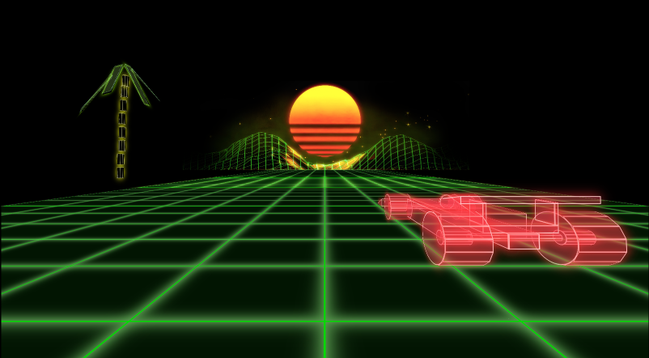
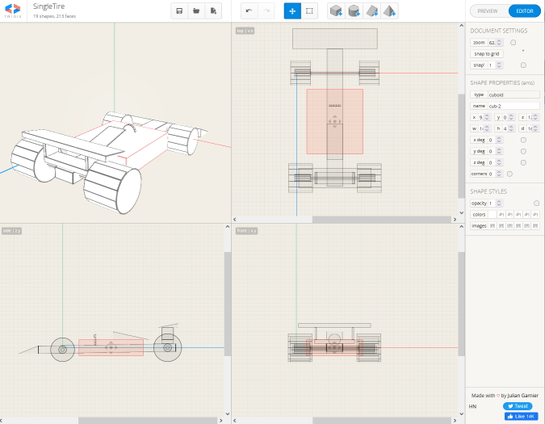

# _Synthwave CSS 3D Engine Demo_

### 🤝 Contributors 
_code and original music **by Eric Crudup**_
<p align="center">
  
</p>    

---
## 🌐 About the Project     
<br><br/>
### 📖 Description
 _I made this application to explore what's possible with 3D transformations of HTML elements using CSS. My idea was to create a simple 3d scene rendered 100% with HTML elements, transformed by a CSS stylesheet. There are multiple javascript libraries that specialize in 3D modeling and animation such as three.js, and if I were to make something like this commercially, I wouldn't hesitate to use one of those libraries. Using a library would have made the project MUCH easier and the final results would have been better IMO. My goal here was to push the limits of CSS and take it places it wasn't necessarily designed to go. For funsies. [Live GH-Pages Deployment](https://cruduper.github.io/Synthwave-3D-CSS-Engine/)_
<br><br/>
#### _**! IMPORTANT !** -- In order to run this **you will likely need to have a semi-modern GPU installed on your machine**. It is unlikely to run at a usable framerate using onboard graphics. **Google Chrome is the preffered browser** to run this application at this time. In some other browsers I tested, the app ran anywhere from slow to unusably slow and the intro animations executed incorrectly. I created an "Eco" mode that uses fewer resources and runs slightly faster (see Controls). I plan on optimizing performance both generally and for specific browsers at a later date._       
<br><br/> 

### 🎮 Controls
```
Turn Left: left Arrow key
Turn Right: Right Arrow key
Boost: Up Arrow key
Camera Angle Change: 'C' key
Developer Mode: 'D' key
"Eco" Mode toggle: 'E' key
```

<br><br/>
### 🛠 Technologies Used

* _JavaScript_
* _HTML_
* _CSS_
* _npm_
* _eslint_
* _tridiv_

<p align="center">
  
</p>

<br><br/>

### 🦠 Known Bugs OR Issues

1. Palm trees change position during boost (generalized, animations change/reset if animation speed or other variables change). This may be due to CSS doing the calculations for any transition from one value to another only once (at very start of the animation). If this is the case, fixing it might be impossible with CSS, but the problem could be alleviated using a javascript library to do my animations, such as Greensock (https://greensock.com/gsap/) or Velocity (http://velocityjs.org/). But that is beyond the scope of the project. I will need to investigate this bug more fully to see if anything can be done.

2. Red glowyness still suddenly appears on car during "Eco" mode during "boost" animation, making it look like the car changes color slightly. This needs to be fixed, but I still might want white glow to happen on tires during "Eco" mode. 

3. When the user pressed the left key immediately followed by the right key with very fast timing, the cars turning speed is doubled. 

4. Many parts of the code need refactoring. 

5. More CSS variables should be made to keep the code DRY. 

6. Intro animations look wrong in some non-chrome browsers

7. Timing of intro animations is off in some non-chrome browsers. 

<br><br/>
## 🏁 Getting Started

### ⚙️ Setup/Installation Requirements

* _Clone git repository to a local machine_
* _navigate to root folder of the project using command line_
* _use the '$ npm install' command to install necessary packages_
* _type in '$ npm run build' to build project_
* _type in '$ npm run start' command to open project in browser and start live server_
* _have a great time all the time_

## ⚖️ License

License for my code (but not music): [MIT](https://opensource.org/licenses/MIT)    

```
MIT License
Permission is hereby granted, free of charge, to any person obtaining a copy
of this software and associated documentation files (the "Software"), to deal
in the Software without restriction, including without limitation the rights
to use, copy, modify, merge, publish, distribute, sublicense, and/or sell
copies of the Software, and to permit persons to whom the Software is
furnished to do so, subject to the following conditions:
The above copyright notice and this permission notice shall be included in all
copies or substantial portions of the Software.
THE SOFTWARE IS PROVIDED "AS IS", WITHOUT WARRANTY OF ANY KIND, EXPRESS OR
IMPLIED, INCLUDING BUT NOT LIMITED TO THE WARRANTIES OF MERCHANTABILITY,
FITNESS FOR A PARTICULAR PURPOSE AND NONINFRINGEMENT. IN NO EVENT SHALL THE
AUTHORS OR COPYRIGHT HOLDERS BE LIABLE FOR ANY CLAIM, DAMAGES OR OTHER
LIABILITY, WHETHER IN AN ACTION OF CONTRACT, TORT OR OTHERWISE, ARISING FROM,
OUT OF OR IN CONNECTION WITH THE SOFTWARE OR THE USE OR OTHER DEALINGS IN THE
SOFTWARE.
```
If you have any issues or questions, or would like to permission to use my original music, 
contact me at briefcasemanx@gmail.com.    
Copyright (c) _2022_  _Eric Crudup_

<center><a href="#">Return to Top</a></center>
